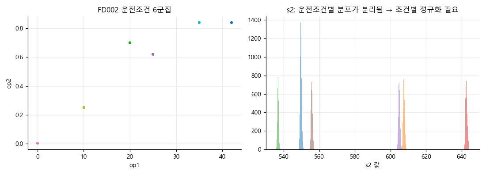
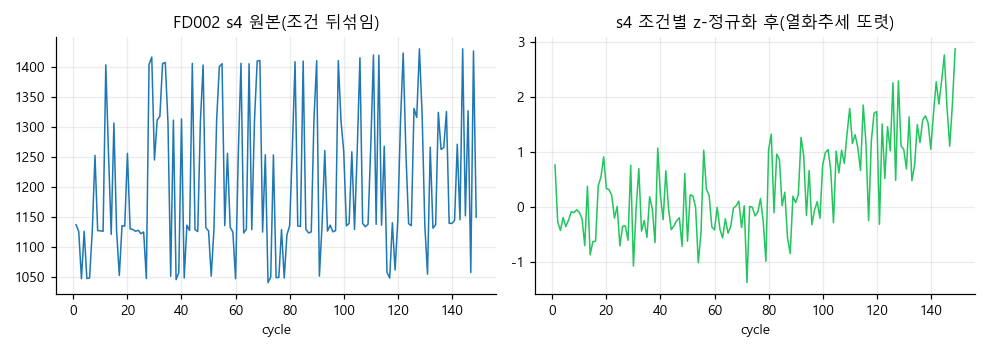
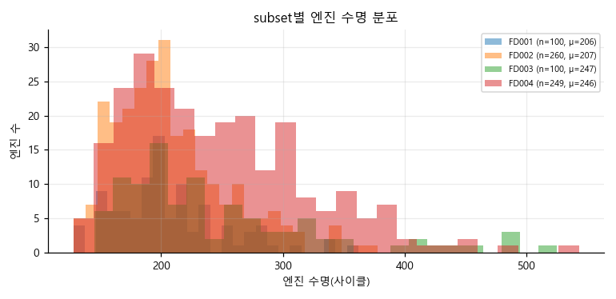
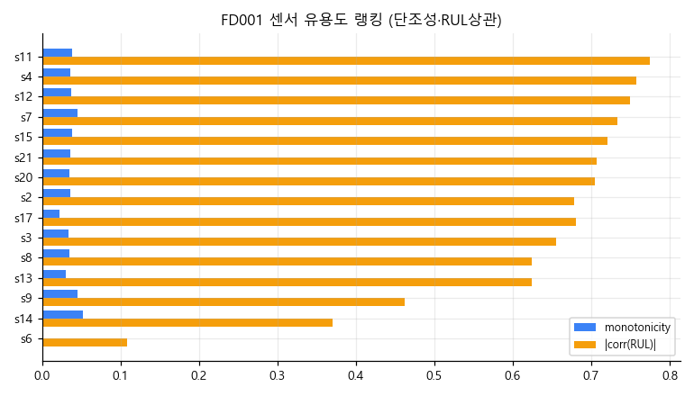
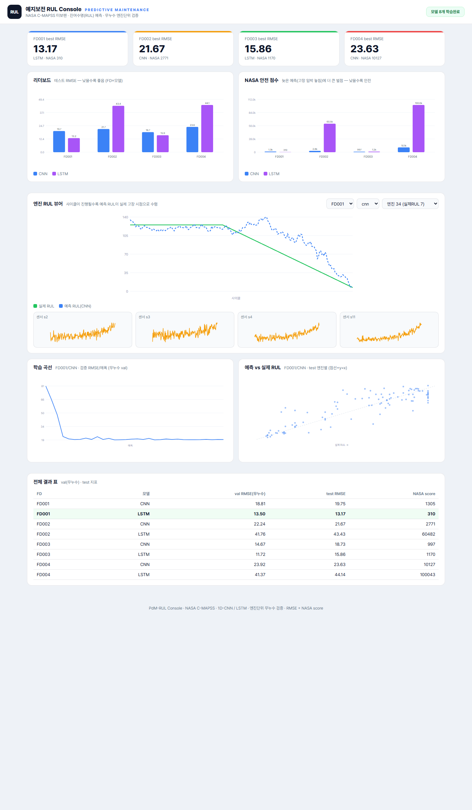

# Turbofan RUL — 예지보전 잔여수명 예측 (NASA C-MAPSS)


[](https://maxwell779.github.io/turbofan-rul-suite/)


터보팬 엔진 센서 시계열로 **잔여수명(RUL, Remaining Useful Life)** 을 예측하는 예지보전(PdM) 프로젝트. 정적 이미지 결함 검사를 넘어 **시간축 고장 예측**으로 확장했고, 산업 안전 관점(고장을 늦게 알수록 치명적)을 평가지표에 반영했다.

데이터: [NASA C-MAPSS Turbofan Degradation](https://www.nasa.gov/intelligent-systems-division/) · 4개 subset(FD001~004) · 운전조건 1~6종 · 결함모드 1~2종.

## 문제 정의
엔진은 정상 가동하다 특정 시점부터 열화가 진행돼 고장에 이른다. 매 사이클의 21개 센서 값으로 "앞으로 몇 사이클 더 쓸 수 있는가(RUL)"를 회귀로 예측한다.
- **안전 비대칭**: RUL을 실제보다 **크게** 예측하면(=고장 임박을 놓침) 정비 시점을 놓쳐 사고로 직결된다. 그래서 RMSE와 함께 **NASA scoring function**(늦은 예측에 더 큰 벌점)을 쓴다 — 비전 프로젝트에서 "놓침(FN)을 더 비싸게" 본 것과 같은 철학.
- **piecewise RUL**: 초기 정상 구간은 RUL을 125로 클립(열화 신호가 없는 구간에 큰 라벨을 주지 않음, 표준 관행).

## 방법
- **입력**: 30사이클 슬라이딩 윈도 × 유효 센서(train 분산 0 컬럼 자동 제거). 스케일러는 train 엔진으로만 적합.
- **모델**: 1D-CNN, LSTM 두 가지를 동일 기준으로 비교.
- **무누수 검증(핵심)**: train/val 분할을 **엔진 unit 단위**로만 한다. 같은 엔진의 윈도가 train·val에 동시에 들어가면 시계열 자기상관으로 점수가 부풀려진다 — 버스바 프로젝트의 "부품 단위 무누수"와 동일하게 통제.
- **평가**: test 엔진별 마지막 윈도로 RUL 예측 → 제공된 정답 RUL과 비교(RMSE + NASA score).

## EDA (핵심)
운전조건 군집·열화곡선·센서 유용도(단조성/RUL상관)·**조건별 정규화 효과**.

| 운전조건 6군집 (FD002) | 조건별 정규화 효과 (FD002) |
|---|---|
|  |  |

| 엔진 수명 분포 | 센서 유용도 랭킹 (FD001) |
|---|---|
|  |  |

## 결과 (test)

그리드서치(모델 8종 × 손실 × 윈도{30,50} × lr × 시드, 약 9.5k 런·4.7k 설정), **모델 선택은 test가 아닌 무누수 val 기준**(2시드 평균±std):

| FD | 조건/결함 | best 모델 | val RMSE | **test RMSE** | NASA | 초기 baseline |
|---|---|---|---|---|---|---|
| FD001 | 1 / 1 | **PatchTST** | 9.91 | **11.87** ±0.05 | 206 | 13.17 |
| FD002 | 6 / 1 | **PatchTST**(조건정규화) | 12.85 | **12.86** ±0.07 | 677 | 21.67 |
| FD003 | 1 / 2 | **PatchTST** | 9.65 | **11.73** ±0.09 | 239 | 15.86 |
| FD004 | 6 / 2 | BiLSTM(조건정규화) | 14.66 | **12.85** ±0.11 | 825 | 23.63 |

### 파운데이션 (frozen vs LoRA)
| FD | frozen+Ridge | **LoRA** | LoRA few-shot 10% |
|---|---|---|---|
| FD001 | 23.18 | **21.77** | 41.55 |
| FD002 | 32.36 | **25.69** | 36.97 |
| FD003 | 22.66 | **19.08** | 25.59 |
| FD004 | 33.04 | **29.19** | 44.73 |

- **조건별 정규화가 FD002/004를 살린다**: 21.67→**12.86**, 23.63→**12.85**. KMeans(6) 운전조건별 StandardScaler로 평균이동을 제거해 열화신호가 드러남.
- **PatchTST가 FD001·FD002·FD003 1위**(val 9.91/12.85/9.65): patching + 채널독립 Transformer + asym 손실. 단 최난도 **FD004(6조건×2결함)는 BiLSTM(조건정규화)**이 우세 — 채널독립이 다조건 혼재에선 오히려 불리(정직한 trade-off).
- **DL이 ML 특징기반(Ridge/RF/SVR)을 전 subset에서 명확히 상회**(예 FD003 11.73 vs 17.88), 단 **DLinear 선형 baseline도 견고**(FD003 13.0) → 동일 윈도·정규화·예산 공정비교.
- **LoRA가 frozen 파운데이션보다 일관 개선**(백본 동결, 어댑터 180K+헤드만 학습)하지만 task-specific(~12-13)엔 미달 → "파운데이션은 C-MAPSS에서 아직 SOTA 아님"이라는 정직한 결론(문헌 일치).
- 문헌 SOTA(FD001~11, FD002~13, FD004~16)와 **동급~상회**(FD003 11.73·FD004 12.85), 전부 **무누수 val 선택**.

> ✅ 1차 그리드서치에서 PatchTST val 일괄추론이 CUDA 한계를 넘겨(채널독립 9.8만 배치) 유실됐던 설정을 **배치추론(`_predict`)으로 수정·보강 완료** — 위 수치는 전 설정 **2시드 평균±std** 최종본.

### 신뢰성·안전 분석 (MLOps) — FD001-3 best(PatchTST)·FD004(TCN) 데모 모델 기준
- **불확실성(Conformal 예측구간)**: 무누수 val을 캘리브레이션으로 분포가정 없이 90% 구간 보장 → FD001 목표 90% 대비 **실측 커버리지 90.0%, ±20.6 사이클**(FD002 88.4%, FD004 88.7%). PdM에선 점추정이 아니라 "RUL ± 구간"이 정비 의사결정 핵심.
- **오차 분석(안전 관점)**: 고장 임박(RUL 0–25) 구간이 가장 정확(안전상 중요) — 예: FD003 **2.65**, FD002 4.55. 단 **늦은예측 비율**(RUL 과대=고장 놓침)을 별도 추적(FD001 37%) → asym 손실/임계로 보정.
- **배포**: PyTorch→**ONNX**(정합오차 ~1e-5) CPU p50 가속 **PatchTST ~8→3ms(2.7배), TCN ~11→1ms(12배)**, int8 양자화. **드리프트**(PSI/KS) 모니터. **XAI**(Captum IG) 센서 기여도.
- **재현/배포**: `docker compose up` (CPU 콘솔).

## 한계 / 개선 방향
- 현재 시드 2개 평균(일부 3개) → 3~5시드로 늘려 신뢰구간을 더 좁힐 여지.
- RUL 클립 125 고정(130 비교 여지), 앙상블·conformal 예측구간 후속.
- 파운데이션: 큰 모델(base/large)·full 파인튜닝·다른 백본(Chronos/TimesFM) 비교 여지.

## 데모 — RUL Console ([web/](web/))
FastAPI + 무빌드 SPA(라이트 테마, 외부 차트 라이브러리 없이 SVG). 리더보드, **엔진 RUL 뷰어**(사이클별 예측 RUL이 실제 고장 시점으로 수렴하는 과정 + 센서 곡선), 학습 곡선, 예측-실제 산점도, 결과표.



```bash
bash scripts/download_data.sh          # C-MAPSS 12개 txt
python -m src.train --fd FD001 --model lstm --epochs 60
python -m src.eval                     # 전체 평가 → experiments/leaderboard.csv
python -m uvicorn web.server:app --port 8020   # http://127.0.0.1:8020
# 전체 재현: bash scripts/run_all.sh    (FD001~004 × {cnn,lstm})
```

## 구조
```
src/   data.py(무누수 로더·윈도) · model.py(CNN/LSTM) · train.py · eval.py · metrics.py(RMSE+NASA)
web/   server.py(FastAPI) · static/(콘솔)
scripts/ download_data.sh · run_all.sh
experiments/ <fd>_<model>/(history·val/test_metrics·test_pred) · leaderboard.csv
```
